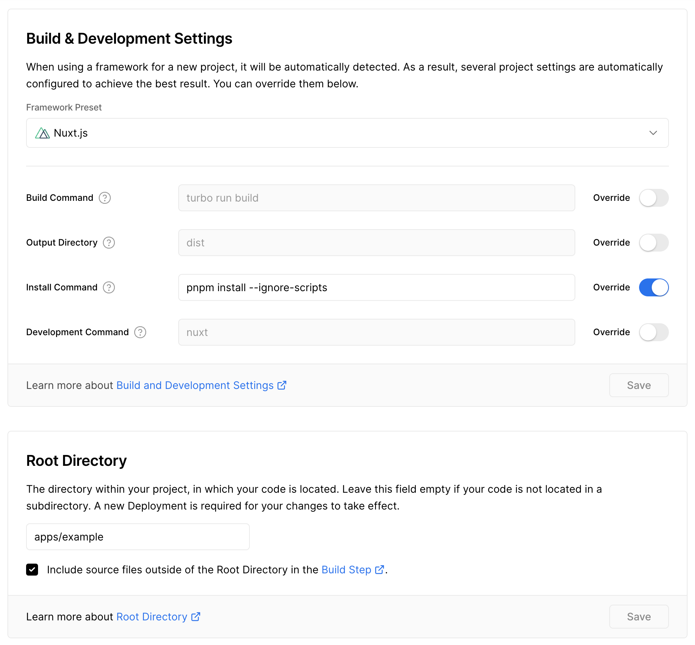

# Repo Guide

This is a monorepo housing `packages` (modules that are released on npm) and `apps` (examples / applications to be deployed)

## Packages

- `module`
- `layer`

### `module`

The `module` package has the `@nuxt-fable/module` nuxt module. It uses the [`vue-docgen-vite-plugin`](./packages/module/src/vue-docgen-vite-plugin.ts) to add the `__docgenInfo` property to all components that vite loads (has props, slots, etc). The module loads all stories matching `"/**/*.story.*"` and makes them accessible in the `getStories` function exported from the `#stories` nuxt alias.

The module autogenerates basic stories for all components in your `components` directory.

### `layer`

The `layer` package has the `@nuxt-fable/layer` nuxt module. It uses `@nuxt-fable/module` and renders the stories/controls in a configurable shell.

## Apps

- WIP

## Vercel

- the mix of [turbo.json](./turbo.json) and  has made me nearly quit web dev